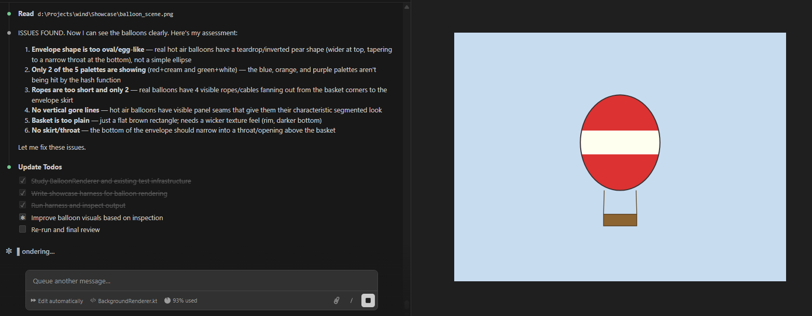
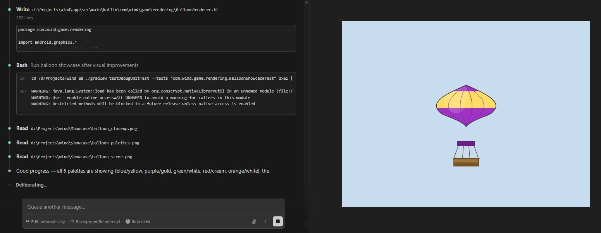
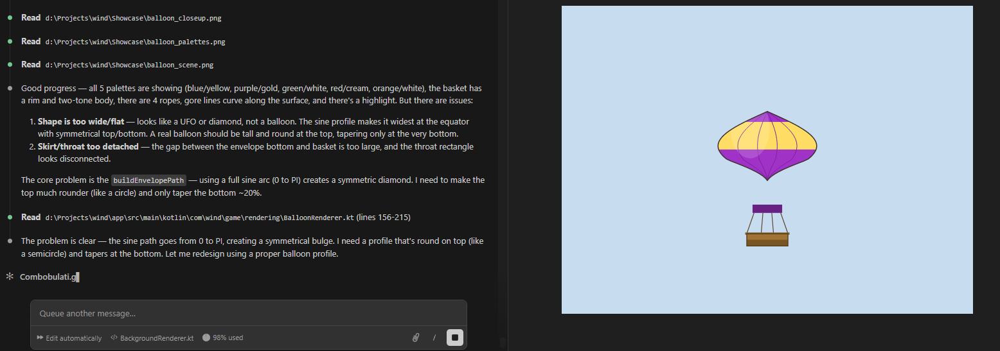
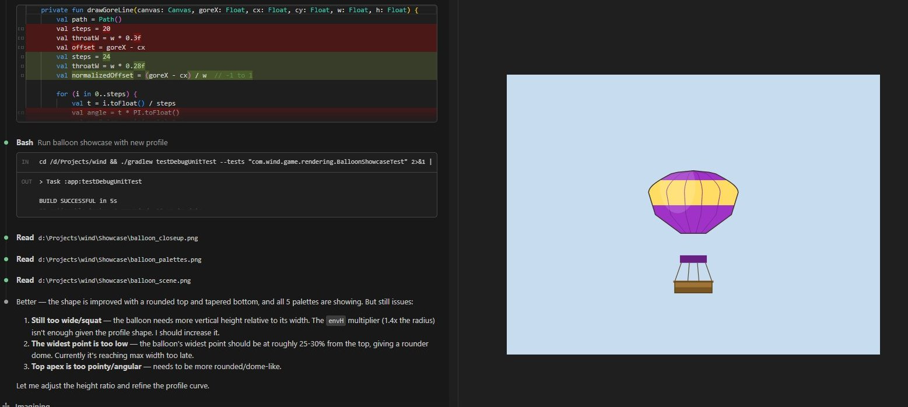
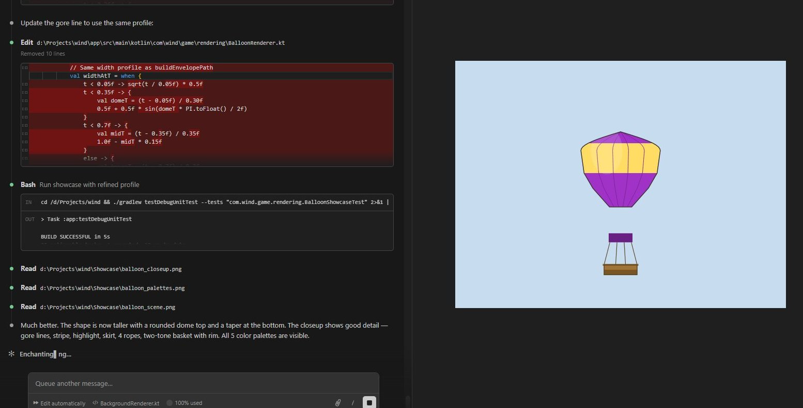
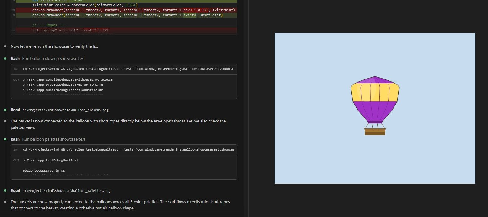

# Showcase Tuning

Showcase tuning is a workflow for visually debugging rendering code. You generate PNG images directly from your actual renderer, inspect them, and fix issues iteratively - until the output looks right.

The core idea is simple: instead of guessing whether your renderer works, you make it *show* you.

---

## The Problem with Testing Rendering Code

Rendering code is uniquely hard to verify. You can assert that a function returns without crashing, but you can't assert that the output *looks correct*. Traditional approaches fall short:

- **Unit tests** verify logic but can't catch visual defects like inverted normals, clipped sprites, or washed-out colors
- **Running the full app** is slow, requires UI interaction, and makes it hard to isolate a single component
- **Manual inspection during development** is ad-hoc and hard to reproduce

Showcase tuning fills this gap.

---

## The Concept

The workflow is built around a simple loop:

**Write a harness → Run it → Look at what came out → Fix the renderer → Repeat**

The harness is a small, standalone program that constructs the minimum inputs your renderer needs, calls it directly, and saves the output as a PNG. It's not a reimplementation - it's a camera pointed at your actual code.

A few properties make this work well:

**Deterministic inputs.** Use fixed seeds and hardcoded test data so the harness produces identical output on every run. This makes before/after comparison meaningful - you can tell at a glance whether a fix actually changed anything.

**Fix the renderer, not the harness.** When an image looks wrong, the defect is in your rendering code. Trace it back to the specific function or line and fix it there. The harness is just a capture mechanism; it stays stable.

**Generate before reviewing.** Never guess what the output looks like. Always produce and inspect the actual image.

**One component at a time.** Isolating a single renderer keeps the feedback loop tight and the results unambiguous.

---

## The Loop in Practice

Say you're building a tile map renderer and something looks off at higher zoom levels. You'd write a harness that generates `tilemap_zoom_1x.png` and `tilemap_zoom_2x.png` using hardcoded map data. You run it, open the images, and see 1px gaps between tiles at 2x but not at 1x. You trace that to an integer truncation in the coordinate transform, fix it, re-run, re-inspect. The gaps are gone. Done.

The whole cycle - harness to fix to verified output - can take minutes rather than hours of exploratory debugging.

---

## The Claude Code Skill

This repo includes a [`showcase-tuning.skill.md`](showcase-tuning.skill.md) file for [Claude Code](https://github.com/anthropics/claude-code) that implements showcase tuning as an agentic workflow. You give Claude a rendering component to focus on; Claude runs the entire loop autonomously.

### Installation

Copy `showcase-tuning.skill.md` into your project's `.claude/commands/` directory, or reference it directly when starting a session.

### Usage

Activate it by telling Claude what to showcase:

```
showcase tune the particle system
showcase the tile map renderer at night
showcase the character sprite with all animation frames
```

Claude will ask for any missing context, then handle everything from there.

### Inputs

| Input | Required | Example |
|-------|----------|---------|
| Focus area | Yes | `"the 3D scene renderer"`, `"the tile map"`, `"character sprites"` |
| Conditions | No | `"at night"`, `"with fog enabled"`, `"zoomed in 2x"` |
| Known issues | No | `"colors look washed out"`, `"sprites clip through walls"` |

### What Claude Does

1. **Reads the rendering code** - before writing anything, Claude studies the target renderer, traces its inputs and output format, and checks for existing test infrastructure
2. **Writes a harness** - a standalone program that calls your actual rendering code with deterministic inputs and saves PNGs to `Showcase/`
3. **Runs it** - builds and executes the harness using your project's build system
4. **Inspects the images** - opens each PNG and evaluates it: blank? corrupted? correct colors? correct layering? correct perspective?
5. **Fixes and iterates** - if issues are found, Claude traces each defect to its source in the rendering code, fixes it, re-runs, and re-inspects until everything passes

### Output

PNGs are written to a `Showcase/` directory at the project root:

```
Showcase/tilemap_day.png
Showcase/tilemap_night.png
Showcase/particles_dense.png
Showcase/character_idle_frame3.png
```

The directory is added to `.gitignore` automatically - generated artifacts, not source files.

At the end of the session Claude gives a summary: images generated, issues found and fixed, code changed, and any remaining concerns outside the focus area.

### Platform Support

The skill adapts to any rendering stack:

| Platform | Approach |
|----------|----------|
| Android / JVM | Instrumented test or Robolectric; `ImageIO.write()` for pure JVM |
| Web / TypeScript | Node.js + `canvas` or Puppeteer/Playwright for browser renderers |
| Python | Pillow; `savefig()` for matplotlib/plotly |
| Rust / C++ | `image` crate or `stb_image_write` |

---

## Example: Visual Walkthrough

The following screenshots show a real showcase tuning session where Claude iteratively fixes a hot air balloon renderer in an Android/Kotlin project. Each step represents one pass through the inspect-fix-rerun loop.

**Step 1 - Initial inspection.** Claude runs the harness for the first time and inspects the output. The balloon is a simple oval with only 2 of 5 color palettes rendering. Claude identifies 6 distinct issues: wrong envelope shape, missing palettes, short ropes, no gore lines, plain basket, and no skirt/throat.



**Step 2 - First round of fixes.** After editing the renderer, Claude re-runs the harness. All 5 color palettes now appear, the basket has a rim, gore lines curve along the surface, and there are 4 ropes. But the envelope shape is wrong - it looks like a diamond or UFO due to a symmetric sine profile.



**Step 3 - Diagnosing the shape.** Claude reads the generated images and traces the shape problem to `buildEnvelopePath` - the full sine arc (0 to Pi) creates a symmetric bulge. It needs a profile that's round on top and tapers at the bottom.



**Step 4 - Profile redesign.** Claude rewrites the envelope profile curve. The shape now has a rounded top and tapered bottom, but it's still too wide and squat - the widest point sits too low, and the apex is too angular.



**Step 5 - Refined profile.** After adjusting the height ratio and profile curve, the balloon is now taller with a proper dome top and taper. The closeup shows good detail: gore lines, stripe, highlight, skirt, ropes, and a two-tone basket with rim. All 5 palettes render correctly.



**Step 6 - Final verification.** Claude fixes the last issue - the basket was floating too far below the envelope. The skirt now flows directly into short ropes that connect to the basket, creating a cohesive hot air balloon shape across all 5 color palettes. Session complete.



---

<details>
<summary>Text example: tile map renderer session</summary>

```
You:    showcase tune the tile map renderer, zoomed in 2x
        known issue: tiles look misaligned at higher zoom levels

Claude: [reads TileMapRenderer.kt and related files]
        [writes harness generating tilemap_zoom_1x.png and tilemap_zoom_2x.png]
        [runs harness]
        [inspects images]

        ISSUES FOUND:
        - tilemap_zoom_2x.png: 1px gaps visible between tiles at zoom > 1.0
          Source: TileMapRenderer.kt:84 - integer truncation in coordinate
          transform causes sub-pixel rounding errors

        [fixes TileMapRenderer.kt:84]
        [re-runs harness, re-inspects]

        PASS: Both images render correctly. Tiles are flush at 1x and 2x zoom.

        Images generated:
          Showcase/tilemap_zoom_1x.png - tile map at default zoom
          Showcase/tilemap_zoom_2x.png - tile map at 2x zoom

        Changes made:
          TileMapRenderer.kt:84 - replaced int cast with floor() to preserve
          sub-pixel precision during coordinate transform
```

</details>

---

## Contributing

The skill behavior is defined entirely in [`showcase-tuning.skill.md`](showcase-tuning.skill.md). To improve it, edit the phase descriptions, add platform-specific guidance, or expand the visual review checklist.
